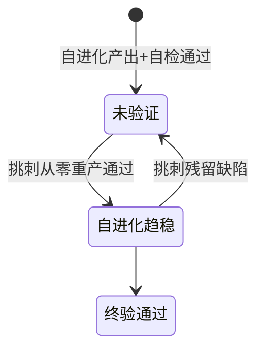

# Design - 跨端设计能力中心

一站式设计 Skill。设计能力按领域分层，每个领域独立 spec 作为唯一事实来源；本文件负责需求分流与流程编排，规范/操作/验收在各 spec。

遵循项目 SDD：spec 与产出始终一致，spec 是活文档，先改 spec 再改产出。

## 何时使用

改动「看起来怎样 / 用起来怎样 / 品牌表达怎样 / 动起来怎样 / 文案怎么写」即触发（用户未必说「设计」二字）。按场景路由：

| 场景 | 触发示例 | 路由到 |
|------|---------|--------|
| Web 页面/组件设计 | 「设计一个落地页」「做个数据仪表盘」 | specs/web |
| 移动端界面设计 | 「设计 iOS 首页」「做个 Android 商品卡」 | specs/mobile |
| 品牌视觉系统 | 「设计品牌 Logo」「出一套品牌色彩体系」 | specs/brand |
| 启动图/图标/切图 | 「生成启动图」「出 iOS 图标集」 | specs/mobile |
| 内容封面/头图 | 「做公众号头图」「出一套小红书封面」「YouTube 缩略图」 | specs/cover |
| 设计系统/Token | 「建一套设计 Token」「定义组件库」「色彩体系怎么用」 | specs/design-system |
| 动效/动画 | 「定义动效规范」「页面转场怎么做」「加载动画」 | specs/motion |
| 插画/空状态 | 「设计空状态插画」「出引导页插画」「错误页插画」 | specs/illustration |
| 图标系统 | 「出一套 UI 图标」「图标线宽怎么定」「图标命名」 | specs/icon-system |
| 内容设计/文案 | 「按钮文案怎么写」「错误提示文案」「空状态文案」 | specs/content |
| 设计研究/竞品 | 「竞品分析」「设计研究」「moodboard」「找参考」 | specs/research |
| 标注/切图/交付 | 「出标注文档」「交付给开发」「走查清单」 | specs/handoff |
| 页面描述/低保真 | 「出页面描述」「写页面描述文档」「出低保真线框」「画线框图」 | specs/workflow |
| 页面走查/审阅 | 「页面走查」「审查页面」「低保真审阅」「反馈收集」 | specs/review |
| 设计流程编排 | 「从 PRD 到设计」「完整设计流程」「设计到交付流程」 | specs/workflow |
| 规范定制/覆盖 | 「定制项目设计规范」「覆盖默认色彩」 | specs/spec-customization |
| 跨端一致性 | 「Web 和移动端风格统一」 | 先 specs/brand，再 specs/web + specs/mobile |

## 能力总览

specs 结构见下方代码块；每个 spec 统一结构：设计目标 → 操作流程 → 规范要求 → 验收标准 → 边界与不做项。

```
design/
├── SKILL.md                    ← 你在这里：流程编排与路由
├── scripts/
│   ├── toapis.py               ← AI 图像/视频生成封装（接入 ToAPIs）
│   └── validate.mjs            ← 仓库一致性校验（改完 spec/SKILL.md 必跑，见「仓库一致性校验」）
├── config/
│   └── .env                    ← API Key 配置（不上传，见 .gitignore）
└── specs/
    ├── web/                    ← Web 界面设计规范
    │   └── web-design.md
    ├── mobile/                 ← 移动端设计规范（跨端共用 + 平台深潜）
    │   ├── mobile-design.md
    │   ├── ios.md              ← iOS 平台深潜（Apple HIG）
    │   ├── android.md          ← Android 平台深潜（Material 3）
    │   └── harmony.md          ← 鸿蒙平台深潜（HarmonyOS UX）
    ├── brand/                  ← 品牌视觉系统设计规范
    │   └── brand-design.md
    ├── cover/                  ← 内容封面设计规范（公众号/小红书/YouTube/B站等）
    │   └── cover-design.md
    ├── design-system/          ← 设计系统（Token 架构 + 组件库 + 模式）
    │   └── design-system.md
    ├── motion/                 ← 动效系统（跨端统一动效语言）
    │   ├── motion-design.md
    │   └── motion-audio-rules.md   ← 动效与声音进阶细则（easing 语义名 / orchestration / SFX 工程）
    ├── illustration/           ← 插画系统（空状态/引导/错误/加载/文章配图）
    │   └── illustration-design.md
    ├── icon-system/            ← 图标系统（跨端设计基线 + 平台深潜）
    │   ├── icon-system-design.md
    │   ├── web.md              ← Web 图标实现（SVG/CSS/currentColor）
    │   ├── ios.md              ← iOS 图标实现（SF Symbols/Asset Catalog）
    │   ├── android.md          ← Android 图标实现（Vector Drawable/密度目录）
    │   └── harmony.md          ← 鸿蒙图标实现（$r 资源引用）
    ├── image-prompt/           ← toapis 生成前的 Prompt 撰写规范（xxx_prompt.md）
    │   └── image-prompt-design.md
    ├── content/                ← 内容设计（按钮文案/错误提示/空状态文案/术语表）
    │   └── content-design.md
    ├── research/              ← 设计研究（竞品分析/模式提取/moodboard）
    │   └── research-design.md
    ├── handoff/                ← 设计交付（标注/切图/Token/走查）
    │   └── handoff-design.md
    ├── workflow/               ← 设计流程编排（PRD -> 低保真 -> 品牌 -> 高保真 -> 交付）
    │   ├── design-workflow.md
    │   └── hi-fi-acceptance-checklist.md   ← 高保真验收（反 slop / 排印 / form 推导五问 / 5 维度评审 / 验证方法）
    ├── review/                 ← 审阅反馈机制（可审阅 HTML + 反馈收集 + 导出）
    │   └── review-design.md
    └── spec-customization/     ← 规范定制与项目级覆盖
        └── spec-customization.md
```

## 统一设计流程

不论路由到哪个能力，遵循五步：理解 → 加载 → 确认 → 执行 → 验收。前四步是「理解 → 加载 → 确认 → 执行」，第五步是交付前硬闸门。

> 完整 PRD→交付流程（研究 / 页面描述 / 低保真 / IP / 高保真 / 交付）见 `specs/workflow/design-workflow.md`（Phase 1-6）；研究是 Phase 0 见 `specs/research`。本节五步是单次任务的通用流程。

1. **需求解构**：提取 产品类型 / 目标用户 / 风格关键词 / 技术约束 / 目标平台；缺失即追问，不凭空假设。
2. **规范加载**：按路由表读对应 spec；涉及品牌/跨端先读 `specs/brand` 建基线（色彩/字体/基调），品牌是跨端锚点。
3. **方向确认**：基于 spec 风格给 1-2 个方向（含色彩基调、字体配对），与用户确认再执行——方向未定直接出成品是最大返工源。
4. **设计执行**：按 spec 逐步执行，每步产出可审阅中间件（品牌层色板/字体层级、页面层信息架构/线框/高保真、组件层变体/标注、资源层切图/Token）。
5. **验收对齐**：执行该 spec 验收清单逐项核对，未通过项修正再交付；验收是硬闸门非可选。

Phase 3-5 须用 `scripts/toapis.py` 生成真实素材，禁 emoji/CSS 占位。生成前**必须先写 Prompt 文件** `design/output/prompts/<类型>/<素材名>_prompt.md`（结构/品牌绑定/`--ref`/负面词见 `specs/image-prompt`），审阅确认再交给 toapis；禁命令行 `--prompt` 即兴写。

```bash
# 先写 prompt 文件，再：
python3 scripts/toapis.py image --model gpt-image-2 --prompt "$(cat design/output/prompts/brand/ip_base_prompt.md)" --background transparent --save design/output/assets/brand/ip_base.png
python3 scripts/toapis.py models                 # 列可用模型
python3 scripts/toapis.py video --model veo3.1-fast --prompt "$(cat ..._prompt.md)" --aspect-ratio 16:9 --save design/output/intro.mp4
python3 scripts/toapis.py upload --file ./ref.jpg   # 上传参考图后图生图
python3 scripts/toapis.py image --model gpt-image-2 --prompt "改为赛博朋克" --ref https://files.toapis.com/xxx.jpg
```

素材入 `design/output/assets/` 以 `` 嵌入。API Key 在 `config/.env`。生成 URL 有效期 24h，`--save` 及时下载。AI 素材不豁免验收；不理想先改 `xxx_prompt.md` 再生成，不反复改图。

Phase 2 起凡生成可审阅 HTML，保存反馈须 FSAA 写入主路径（`showDirectoryPicker` + IndexedDB 句柄复用）+ Blob 下载降级，缺 FSAA 只做 Blob 下载=验收不通过；生成前对照 `specs/review/review-design.md` 的 FSAA 参考实现与验收清单。

## 路由表

读取 spec 时按用户意图关键词匹配。匹配到多个时，按品牌优先原则处理（先品牌基线，后各端执行）。

| 用户意图关键词 | 读取 |
|----------------|------|
| 落地页、仪表盘、后台、Web 组件、响应式、前端页面 | `specs/web/web-design.md` |
| iOS、Android、鸿蒙、App、移动端、启动图、图标、切图、安全区 | `specs/mobile/mobile-design.md` |
| Logo、品牌色、VI、视觉系统、字体层级、IP 形象、品牌手册 | `specs/brand/brand-design.md` |
| 封面、头图、缩略图、公众号、小红书、YouTube、Bilibili、视频封面 | `specs/cover/cover-design.md` |
| 设计系统、Token、组件库、组件变体、设计 Token 架构 | `specs/design-system/design-system.md` |
| 动效、动画、转场、缓动、时长、动效规范、动效 Token | `specs/motion/motion-design.md` |
| 插画、空状态、引导页插画、错误页插画、加载动画、插画风格、文章配图、内文配图、流程图解、概念图 | `specs/illustration/illustration-design.md` |
| 图标、UI 图标、图标线宽、图标网格、图标命名、图标系统、图标状态、SVG 图标 | `specs/icon-system/icon-system-design.md` |
| 生成提示词、写 prompt、图像生成 Prompt、toapis prompt、效果图 prompt、xxx_prompt.md | `specs/image-prompt/image-prompt-design.md` |
| 按钮文案、错误提示、空状态文案、表单文案、tooltip 文案、microcopy、术语表、UI 文案 | `specs/content/content-design.md` |
| 竞品分析、设计研究、moodboard、情绪板、设计参考、竞品对比、设计模式 | `specs/research/research-design.md` |
| 标注、切图、交付、走查、还原度、设计交付、设计走查 | `specs/handoff/handoff-design.md` |
| 低保真、线框图、页面描述、信息架构、PRD 到设计、设计流程、页面描述文档、页面清单、交付包 | `specs/workflow/design-workflow.md` |
| 页面走查、审阅、反馈收集、走查页面、快捷标记、反馈导出、可审阅 HTML | `specs/review/review-design.md` |
| 高保真验收、反 AI slop、排印底线、form 推导五问、5 维度评审、验证方法 | `specs/workflow/hi-fi-acceptance-checklist.md` |
| 动效/声音进阶（OR：easing 语义名、orchestration、Signal 克制、SFX 工程密度） | `specs/motion/motion-audio-rules.md` |
| 定制规范、覆盖规范、项目规范、设计 Token、master/override | `specs/spec-customization/spec-customization.md` |

## 跨端项目协调

同一品牌多端产出时：

1. 先读 `specs/brand` 确立品牌基线（Logo/色彩/字体/辅助图形/IP）
2. 品牌基线作 Token 注入各端 → 3. 各端按 `specs/web`/`specs/mobile` 平台规范执行 → 4. 各端过各自验收 + 品牌一致性复核

品牌定调、平台定规：品牌 spec 是跨端唯一锚点，各端平台规范（iOS HIG / Material / Web 响应式）是可用性底线，二者不矛盾。

## 规范演进（SDD）

spec 是唯一事实来源、活文档，先改 spec 再改产出：

- **新增设计能力** → 先写/更新对应 spec，再执行
- **调整设计要求** → 先改 spec，再改产出，三者不得长期背离（spec/产出矛盾：以 spec 为准修正产出；spec 有误先修 spec）
- **项目级覆盖**（不改全局 spec）→ `specs/spec-customization`（master + override，多项目共用基线各差异场景）

## 仓库一致性校验（脚本强化的护栏）

改完任何 spec / SKILL.md 后，运行 `node scripts/validate.mjs`。把人工护栏转成可执行约束，失败以非零码退出，应在 spec 变更日志追记触发：

- 无对外部 skill 的来源命名残留（不自称对标外部 skill）
- `specs/` 根下不散落独立 md（细则归子目录）
- SKILL.md 路由/能力树覆盖全部 spec
- 主 spec 有「设计目标 + 验收/边界/收敛 之一」
- spec 内部相对引用存在

当一条规则「文字写不清、产物总踩」时，优先把它做成生成器/校验脚本，而不是在 spec 里加更长说明（脚本化 > 措辞堆叠）。

## 验证推进路线图

能力域全量回归的**唯一推进过程真源**是 `../design/regression/ROADMAP.md`（15 域状态机 + 光标）。自进化任务与挑刺专家任务都以它为准推进、写回状态；两任务各跑一个阶段配合：



```
自进化任务 (0 8 * * *)             挑刺专家任务 (*/10 * * * *)
  读 ROADMAP「下一个」⬜域             读 ROADMAP 最近 ✅ 域
  ── 从零产出 + 对照 spec 自检 ──►    从零重产终验（clean-room）
  ── 回填升级 spec ───────────►  挑刺暴露 → 驱动 spec 升级
  状态 ⬜→✅                           状态 ✅→🛡️（或打回 ⬜）
  推进光标                            写报告 critic-reports/latest.md
```

- 状态机：`⬜ 未验证 → ✅ 自进化趋稳 → 🛡️ 终验通过`；失败/残留回 `⬜`，光标停住。
- 完工门：15 域全 `🛡️` → 进入稳定期·周巡检，只在 spec 变更时重验受影响域。

## spec 变更日志

记录每轮被「交付产物 / 挑刺终验」暴露出的 spec 短板，及对应 spec 回填/升级，供后续轮次不重复修、可回溯。（由 `design-me 自进化 · 按路线图逐域推进验证` 与 `design-me 挑刺专家` cron 任务维护；无 spec 变更的轮次记「本轮无 spec 变更」。）

| 日期 | 能力域 | 产物暴露的短板 | spec 改动文件 | 根因与改法 |
|------|--------|--------------|--------------|-----------|
| 2026-09-27 | motion | 「退场快 60-70%」与时长 Token 下限冲突（.3s 入场的 65% 快=105ms 贴 fast 下限，硬取比例反不自然） | `specs/motion/motion-design.md` | 规则缺冲突仲裁；补「比例与 Token 下限冲突时以 Token 下限为准」 |
| 2026-09-27 | design-system | 「每组件 5 状态变体」对非交互原子（icon/text）机械套用，硬凑 hover/active 假状态 | `specs/design-system/design-system.md`（验收项） | 状态集未按组件语义分级；改「按语义取子集：交互组件 5 态全查，非交互原子查 default/disabled，不适用标 N/A」 |
| 2026-09-27 | brand | 「视觉偏差 <5%」有可执行定义（Token diff）但无人真跑过，靠手数漏检（本轮首跑即抓出 hairline 衍生色未入色板，10%>5%） | `scripts/validate.mjs`（新增 V8 brand-token-diff） | 脚本化：`design/regression/brand/` 有 `*-brand.html`+`assets/*-palette.json` 时解析 :root 与色板逐项 diff，>5% 失败；衍生色也须入色板 |
| 2026-09-27 | mobile | M6「图标集覆盖所有必需尺寸与密度」/「切图 1:1 误差 0」依赖构建管线与真实设计稿，回归/clean-room 环境永远无法真满足（虚勾或永挂） | `specs/mobile/mobile-design.md`（验收 2 条） | 未定义无管线环境的达标形态；补「矢量主文件+分层源+尺寸密度清单表=达标，位图由管线栅格化；无切片任务标 N/A」 |
| 2026-09-27 | icon-system | 「线宽统一/圆角统一/命名规范/currentColor」靠 grep 人工核对（本轮产物 13 枚逐一查）；图标集审阅 HTML 引用本地 SVG 在 file:// 下 42 条 CORS 全盲渲染 | `scripts/validate.mjs`（新增 icon-set 校验）；产物改内联注入 | 结构约束可执行化：viewBox 唯一、stroke-width 单档、linecap/闭合路径 linejoin=round、currentColor、无 text、命名正则；审阅 HTML 须内联 SVG（JS map）而非 <use> 外链 |
| 2026-09-27 | illustration | 「线宽统一/命名/currentColor」结构校验只覆盖 ic_* 前缀，ill_* 插画文件同名目录却会被误判不合规 | `scripts/validate.mjs`（icon-set 校验扩展） | 前缀族化：命名正则放宽为 (ic\|ill)_ 两族分别校验，线宽唯一性/圆角/currentColor 检查同时约束两类 SVG；插画审阅 HTML 同样须内联 SVG（复用 icon-system file:// CORS 教训，spec 不加实现约束） |
| 2026-09-27 | cover | C4 要求「字号/对比度实算复核」但复核动作无落点约束——首轮产物小红书字号占高 8.8%、强调色 on 深底 3.5:1 全靠自查才暴露 | `scripts/validate.mjs`（新增 cover-contrast 校验） | 对比度公式部分直接脚本化：封面矩阵 HTML 提取标题色/强调色/背景色 hex 实算 WCAG，<4.5 即 ✗（低饱和强调色坑由脚本拦截，不再依赖 C4 预警被记住）；字号占高需渲染，保留产物内复核表+SELF-CHECK 记录制 |
| 2026-09-27 | content | 「无确定/OK/好的」「无信息错误文案」「订阅术语一致」靠目测扫文案；脚本首版把术语表禁用词列也当违规（展示≠使用） | `scripts/validate.mjs`（新增 copy-set 校验） | 文本规则可执行化：剥掉 script/style/术语表（table.term 为规范展示）后扫描——按钮文本禁 ^(确定\|OK\|好的)$、禁「出错了/操作失败」、订阅场景禁「开通会员/退订」；语义类（错误三段式/空状态引导）留 spec 文字+自检落名 |
| 2026-09-27 | motion | 「单条 paused timeline orchestrated」默认 GSAP，纯 CSS/无框架产物无从执行该验收 | `specs/motion/motion-design.md` | 规则绑定特定实现；补「无框架等价判定：统一动画序列+delay 链、一处可整体移调」 |
| 2026-09-27 | motion | 「素材库全站统一 assets/sfx/」与无外部依赖单文件原型冲突，合成占位是否合规无约定 | `specs/motion/motion-design.md` | 补「WebAudio 合成占位可，但须显式标注『合成占位，正式音源待补』」 |
| 2026-09-27 | brand | 「视觉偏差 <5%」无度量对象与方法，验收不可执行（产物只能自申报） | `specs/brand/brand-design.md` | 验收含混；补可执行定义「同角色取值与色板/Token 逐项 diff，不一致项 ≤5%，不做像素比对」 |
| 2026-09-27 | brand | 「Logo 转曲」判定未区分交付级源文件与审阅 HTML 展示层 | `specs/brand/brand-design.md` | 判定对象含混；明确「交付级 Logo 源文件须纯 path，审阅 HTML 的 text 标注不在此限」 |
| 2026-09-27 | brand | B6「IP 可选」与验收清单条件冲突，不做时产物易被当缺项 | `specs/brand/brand-design.md` | 可选能力缺声明规则；补「显式 N/A 区块（范围+原因），留空=不通过」 |
| 2026-09-27 | web | 「触控目标 ≥44px」只写在验收清单，W2-W5 流程无提醒，产物 nav CTA 首测 36px 才发现（验收才发现、流程不设防） | `specs/web/web-design.md` | 规则位置错误；W2 正文补触控目标规则（含扩展命中区写法），验收项注明 |
| 2026-09-27 | web | 暗色模式验收项二义：不做暗色算通过还是不通过未定义（W3 有「不想做就别做」但验收未接） | `specs/web/web-design.md` | 条款衔接缺失；验收补「不提供暗色须显式声明仅亮色，隐式缺失=不通过」 |
| 2026-09-27 | web | 「诚实 placeholder」未定标注形式（可见 or 注释），产物自行选可见灰字 | `specs/web/web-design.md` | 规则含混；明确「面向用户的未定数据须可见标注『数据待补：xx』，不可藏注释」 |
| 2026-09-27 | 全域 | 用户指令「删掉所有旧产物重新开始」：`design/regression/` 下 12 个域产物目录已删除，ROADMAP 状态表全部重置为 ⬜，光标归位 workflow。spec 变更日志保留（spec 升级本身不随产物作废） | 无（产物清理） | 过程性产物作废重来；spec 演进累积保留 |
| 2026-09-27 | workflow | 「不得用 emoji/CSS 占位符替代真实素材」与 toapis 不可用/跳过字面冲突，流程死锁；正确期望是诚实降级但 spec 无此路径 | `specs/workflow/design-workflow.md` | 降级路径缺失；补「toapis 跳过时：标注待生成 + prompts/ 先行 + 母题占位 + 替换指引；禁假装已生成」 |
| 2026-09-27 | workflow | 「审阅反馈全部清空」在回归/自动化单人场景无法等效（自审阅秒收敛，检查点虚设） | `specs/workflow/design-workflow.md`（4 处收敛条件） | 场景适配缺失；补「无真人审阅时等效自检：逐项对照收敛条件 + SELF-CHECK.md + 脚本校验」 |
| 2026-09-27 | workflow | 多 viewport 验收对固定画布 App 原型过度要求（768/1440 只是容器居中） | `specs/workflow/hi-fi-acceptance-checklist.md` | 档位未分形态；补「响应式三档全验；App 固定画布验目标尺寸+一档宽屏不破」 |
| 2026-09-24 | workflow | 挑刺终验暴露：静音开关只写在 spec 未定义验证对象（产物页面内无可操作控件，自检虚报 ✅）；页面描述声明态（骨架屏）hi-fi 静默缺失；`transition:all` 与无框架入场 orchestration 无自检可查；模态无 Esc 逃逸、错误行无 role=alert；同屏字号档位无约束 | `specs/workflow/design-workflow.md`（4.2 自检项回填六条） | 验证对象/覆盖面含混；明确「静音开关须原型内可操作」「声明态须有落点或标注未实现原因」「禁 transition:all 逐属性声明」「入场单序列编排（含无框架等价）」「Esc 关模态 + 错误行 role=alert」「同屏字号档位下限」，报告见 design/critic-reports/latest.md |
| 2026-09-27 | web | 5 维度评审只要求「输出标准结构」未定义落盘落点，回归/单页任务中易只心评不落盘、无法复核 | `scripts/validate.mjs`（新增 V6） | 脚本化约束：`design/regression/<域>/` 有实质产物时必须有 SELF-CHECK.md 且含 5 维度分项评分行，缺=校验失败 |
| 2026-09-27 | motion | 验收清单 24 条混排：deck/叙事专属条款（hero 跨片段/焦点 blur/Chunk Reveal）与 UI 原型通用条款同列，逐条打勾时 N/A 项无判定标准（硬勾或漏记二选一） | `specs/motion/motion-design.md`（验收标准重组） | 适用范围未分组；重组为 A（通用必查）/B（deck·叙事）/C（AI 文本·数据）三组，不适用组标 `N/A（<场景>）` |
| 2026-09-27 | web | 「显式仅亮色声明」未定载体（本轮自选 meta+注释，下次可能忘/形式漂移） | `specs/web/web-design.md`（验收清单） | 载体固定：首选 HTML `<meta name="color-scheme" content="light">`，无 HTML 时页面注释或交付说明 |
| 2026-09-24 | web | 挑刺终验暴露：双态提示 err→ok→err 序列切换后内联 color 残留成功色（单态自检各自通过、组合序列失败）；移动端 nav links display:none 且无汉堡替代（导航入口静默消失）；次级正文 15px | `scripts/validate.mjs`（新增 V7 duotone-reset；spec 文本零改动） | 序列化状态残留无脚本可查→V7 静态扫描 style.color 赋色须有重置；移动导航/字号为执行失误，clean-room 修复，报告见 design/critic-reports/latest.md |
| 2026-09-24 | motion | 挑刺终验暴露：①书架回位过渡中再进详情，FLIP 用运动中 getBoundingClientRect 算起点→封面起点跳变 209px（「可中断」原则只有一句，无共享元素竞态细则）；②关闭详情焦点丢到 body；③双击收藏竞态（btn transform 卡死/toast 重计）；④reduced-motion 只关 CSS，JS 内联 FLIP 照跑；⑤stagger 60ms 超 spec 30-50ms 上限 | `specs/motion/motion-design.md`（127 行 FLIP 条款补两句竞态+降级细则）；clean-room `motion-critic-round2/` 修复全部 | 共享元素源在过渡中时改用 offsetLeft/Top 布局锚点（不含 transform）+ 中心差补偿 origin；焦点归还源元素；结果性动作防抖；JS 动效须 matchMedia(reduced-motion) 分支；stagger 收敛为 --stagger Token 40ms |
| 2026-09-24 | design-system | 挑刺终验暴露：①B3 字体实渲染摆拍（声明 Newsreader/Schibsted 却无加载机制，字宽实测全是系统回退）；②移动端 375px hScroll（B2 三列 grid 不收缩）；③outlined/text hover 未实现（tokens.json 有定义文档没有）；④B7 Swift 导出为伪 API 代码；⑤错误提示静态摆拍（role=alert 常驻不随输入切换）；⑥SFX 无页面内静音控件；⑦审阅弹层焦点不闭环（焦点不入弹窗/无 aria-modal/Esc 不归还）；⑧.plus width:32 与 min-width:44 冲突；⑨字号/圆角阶梯与 spec D1 漂移（22/28/36 vs 24/32/48） | `specs/design-system/design-system.md`（D2 回填 7 句：源同源/引用无悬空/webfont 实加载/禁摆拍/弹层 a11y/SFX 静音/响应式 + 验收 2 条）；`scripts/validate.mjs`（新增 V9 ds-token-integrity：引用悬空与 CSS 变量手抄漂移即失败） | 预览/文档与 Token 源双事实来源是根因→V9 固化同源；摆拍类（字体/提示）与弹层 a11y 为 spec 盲区→回填；clean-room `design-system-critic-round2/` 修复全部，报告见 design/critic-reports/latest.md |
| 2026-09-24 | brand | 挑刺终验暴露：①P3「实际字体渲染」摆拍（无 webfont 加载机制，字宽实测=系统 sans 回退）；②单色 Logo SVG #1A1A1A 游离色板外（「色彩不可用未定义色」未覆盖资产源文件）；③反白变体 CSS filter:invert 拼贴（#1A1A1A→#E5E5E5 非品牌色，非中性色会被一并反转）；④CTA 白字 on 焦糖橙 3.3:1<4.5 AA 且色板无加深档；⑤安全空间演示 padding 17px 与标注 48px 不符；⑥marks 按钮 40px<44 触控+弹层焦点不闭环 | `specs/brand/brand-design.md`（B4 回填 3 句：webfont 实加载/Logo 变体用色入板+禁 filter 拼贴/文字承载色 ≥4.5:1 须备加深档 + 验收 1 条）；`scripts/validate.mjs`（新增 V10 brand-svg-palette：assets/*.svg fill/stroke 游离色即失败，负向实证 round1 mono ×5 触发） | 「变体是受控资产不是运行时滤镜」与「字体实际渲染以真实加载为准」为 spec 盲区→回填；round1 色板补 mono 条目；clean-room `brand-critic-round2/`（含专用 cafero-logo-mono-reverse.svg）修复全部，报告见 design/critic-reports/latest.md |
| 2026-09-24 | mobile | 挑刺终验暴露：①Sheet 数据绑定摆拍（openSheet 恒取首行金额+死变量，点任意行同一假详情）；②Sheet 确认钮白字 on accent 2.36:1/暗色 1.95:1<4.5 AA 且色板无白字承载档；③状态栏 SF Symbols 私有区码点在审阅环境渲染为豆腐块；④tab/FAB/统计/bnav 全死交互（aria-current 不切换、主操作零响应）；⑤把手拖拽中 Esc 关闭残留 translateY inline transform（下次打开错位）；⑥弹层焦点不闭环；⑦文案「未保存时关闭将确认」行为不符；⑧图标集 ios/web 清单空目录无交付物；⑨启动图中心图形用文字「拾」而非品牌贝壳资产；⑩未激活 tab 2.65:1+Roboto 无加载机制 | `specs/mobile/mobile-design.md`（M3 回填 2 句：演示页交互真实性 onclick 函数须有定义/宣称 toast 确认须有载体；平台图形资产不摆拍禁私有区码点 + 验收 1 条）；`scripts/validate.mjs`（新增 V11 mobile-interaction：onclick 引用函数未定义=死交互、toast 文案无载体即失败，负向实证 round1 注释触发） | 「可交互」长期停留在人工点检、无脚本兜底是根因→V11 固化死交互；平台图形资产的可渲染环境约束为 spec 盲区→回填；round1 android 注释措辞修正；clean-room `mobile-critic-round2/`（含 icon manifest.json、真实 Logo 启动图）修复全部，报告见 design/critic-reports/latest.md |
| 2026-09-24 | icon-system | 挑刺终验暴露：①安全区声明摆拍——SELF-CHECK 称「全部坐标 ∈[4,20] 无越界」，实际 pin 底部针脚着墨 y=23.08、settings 齿轮 x=1.62，越出 2px 活区 [2,22]（自检只 grep 裸路径坐标，未含描边/2 与圆帽扩展）；②审阅弹层焦点不闭环（无 aria-modal/Tab 12 次逃逸/Esc 后焦点不归还）；③尺寸档位 sm/md/lg/xl 四个死按钮（可聚焦零 handler）；④IC7 导出 Markdown/JSON 完全未实现；⑤三态行仅 2/12 格（IC5/IC7 要求每格）；⑥nav 两格 meta 误标「操作类」；⑦「12 枚」与 13 文件计数不符 | `specs/icon-system/icon-system-design.md`（IC1 回填 1 句：越界判定按实际着墨范围=路径坐标+描边/2+端点扩展，禁裸坐标假通过）；`scripts/validate.mjs`（新增 V12 icon-ink-bounds：SVG 路径数值化展平+着墨范围扫描，越 [2,22] 即失败，负向实证 round1 pin/settings 2 处触发；round1 冻结产物越界留痕不阻塞） | 「安全区」按裸坐标自验是典型假通过——几何约束必须数值化到着墨层→V12 固化；弹层 a11y 为第三轮同款（执行失误）；clean-room `icon-system-critic-round2/`（pin 收针/settings 齿轮重排/焦点困笼/导出实现/三态全格注入）修复全部，报告见 design/critic-reports/latest.md |
