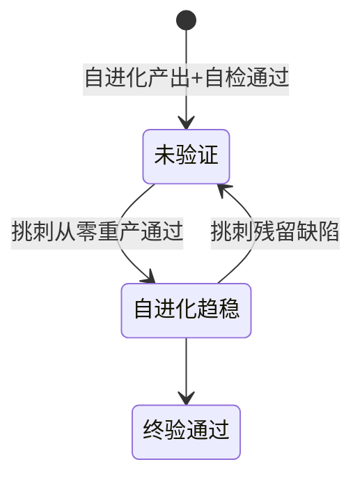

# Design - 跨端设计能力中心

一站式设计 Skill。领域操作与验收在各 spec。设计决策与审美决策的唯一事实来源是「设计与审美双闸门」。本文件负责分流、体量与流程编排。

遵循项目 SDD：spec 与产出始终一致，spec 是活文档，先改 spec 再改产出。

## 设计与审美双闸门

改外观或交互之前先过这两闸。单页、单组件、封面同样要过，不必先跑完 Phase 0–6。各 spec 的色板、字体、签名只消费这里的结论。

有产物目录时，八行写入 `design/output/direction.md`，后续阶段只读这份文件。纯咨询写在回复里即可。有用户在场时，八行未齐或未点头，不写界面。没有用户在场的回归任务，八行落盘后继续，不原地等待。

### 设计四行

- 这一屏只让用户完成的一件事
- 用户此刻的设备、时间和情绪
- 至少三件同类产品会做、本屏故意不做的事
- 唯一主操作，其余如何从属

写不出故意不做的三件，就是在复述品类惯例，先补再往下。

### 审美四行

- 两个真实参考的名字（在售产品、已发布画面，或用户给的图）。风格形容词不算参考
- 从参考抽出的四项：主体位置与留白、标题与正文字号的倍率及行宽、大面积色与点睛色各占多少、材质（纸、玻璃、摄影、平面、金属，取参考实际所用）
- 一句视觉论点，换一个产品名就不成立
- 字族和饱和度各自出自哪个参考

全页只留一处签名，明显精于其余，并且能指认它来自本产品的哪一个名词。指认不出就删掉。

温度跟参考走。安静、热烈、冷硬、柔软都成立，只要能指回那两个参考。

## 何时使用

改动「看起来怎样 / 用起来怎样 / 品牌表达怎样 / 动起来怎样 / 文案怎么写」即触发（用户未必说「设计」二字）。按场景路由：

| 场景 | 触发示例 | 路由到 |
|------|---------|--------|
| Web 页面/组件设计 | 「设计一个落地页」「做个数据仪表盘」 | specs/web |
| 移动端界面设计 | 「设计 iOS 首页」「做个 Android 商品卡」 | specs/mobile |
| 品牌视觉系统 | 「设计品牌 Logo」「出一套品牌色彩体系」 | specs/brand |
| 启动图/图标/切图 | 「生成启动图」「出 iOS 图标集」 | specs/mobile |
| 内容封面/头图 | 「做公众号头图」「出一套小红书封面」「YouTube 缩略图」 | specs/cover |
| 设计系统/Token | 「建一套设计 Token」「定义组件库」「色彩体系怎么用」 | specs/design-system |
| 动效/动画 | 「定义动效规范」「页面转场怎么做」「加载动画」 | specs/motion |
| 插画/空状态 | 「设计空状态插画」「出引导页插画」「错误页插画」 | specs/illustration |
| 图标系统 | 「出一套 UI 图标」「图标线宽怎么定」「图标命名」 | specs/icon-system |
| 内容设计/文案 | 「按钮文案怎么写」「错误提示文案」「空状态文案」 | specs/content |
| 设计研究/竞品 | 「竞品分析」「设计研究」「moodboard」「找参考」 | specs/research |
| 标注/切图/交付 | 「出标注文档」「交付给开发」「走查清单」 | specs/handoff |
| 页面描述/低保真 | 「出页面描述」「写页面描述文档」「出低保真线框」「画线框图」 | specs/workflow |
| 页面走查/审阅 | 「页面走查」「审查页面」「低保真审阅」「反馈收集」 | specs/review |
| 设计流程编排 | 「从 PRD 到设计」「完整设计流程」「设计到交付流程」 | specs/workflow |
| 规范定制/覆盖 | 「定制项目设计规范」「覆盖默认色彩」 | specs/spec-customization |
| 跨端一致性 | 「Web 和移动端风格统一」 | 先 specs/brand，再 specs/web + specs/mobile |

## 能力总览

specs 结构见下方代码块；每个 spec 统一结构：设计目标 → 操作流程 → 规范要求 → 验收标准 → 边界与不做项。

```
design/
├── SKILL.md                    ← 你在这里：流程编排与路由
├── scripts/
│   ├── toapis.py               ← AI 图像/视频生成封装（接入 ToAPIs）
│   └── validate.mjs            ← 仓库一致性校验（改完 spec/SKILL.md 必跑，见「仓库一致性校验」）
├── config/
│   └── .env                    ← API Key 配置（不上传，见 .gitignore）
└── specs/
    ├── web/                    ← Web 界面设计规范
    │   └── web-design.md
    ├── mobile/                 ← 移动端设计规范（跨端共用 + 平台深潜）
    │   ├── mobile-design.md
    │   ├── ios.md              ← iOS 平台深潜（Apple HIG）
    │   ├── android.md          ← Android 平台深潜（Material 3）
    │   └── harmony.md          ← 鸿蒙平台深潜（HarmonyOS UX）
    ├── brand/                  ← 品牌视觉系统设计规范
    │   └── brand-design.md
    ├── cover/                  ← 内容封面设计规范（公众号/小红书/YouTube/B站等）
    │   └── cover-design.md
    ├── design-system/          ← 设计系统（Token 架构 + 组件库 + 模式）
    │   └── design-system.md
    ├── motion/                 ← 动效系统（跨端统一动效语言）
    │   ├── motion-design.md
    │   └── motion-audio-rules.md   ← 动效与声音进阶细则（easing 语义名 / orchestration / SFX 工程）
    ├── illustration/           ← 插画系统（空状态/引导/错误/加载/文章配图）
    │   └── illustration-design.md
    ├── icon-system/            ← 图标系统（跨端设计基线 + 平台深潜）
    │   ├── icon-system-design.md
    │   ├── web.md              ← Web 图标实现（SVG/CSS/currentColor）
    │   ├── ios.md              ← iOS 图标实现（SF Symbols/Asset Catalog）
    │   ├── android.md          ← Android 图标实现（Vector Drawable/密度目录）
    │   └── harmony.md          ← 鸿蒙图标实现（$r 资源引用）
    ├── image-prompt/           ← toapis 生成前的 Prompt 撰写规范（xxx_prompt.md）
    │   └── image-prompt-design.md
    ├── content/                ← 内容设计（按钮文案/错误提示/空状态文案/术语表）
    │   └── content-design.md
    ├── research/              ← 设计研究（竞品分析/模式提取/moodboard）
    │   └── research-design.md
    ├── handoff/                ← 设计交付（标注/切图/Token/走查）
    │   └── handoff-design.md
    ├── workflow/               ← 设计流程编排（PRD -> 低保真 -> 品牌 -> 高保真 -> 交付）
    │   ├── design-workflow.md
    │   └── hi-fi-acceptance-checklist.md   ← 高保真验收（反 slop / 排印 / form 推导五问 / 5 维度评审 / 验证方法）
    ├── review/                 ← 审阅反馈机制（可审阅 HTML + 反馈收集 + 导出）
    │   └── review-design.md
    └── spec-customization/     ← 规范定制与项目级覆盖
        └── spec-customization.md
```

## 统一设计流程

不论路由到哪个能力，遵循五步：理解 → 加载 → 确认 → 执行 → 验收。前四步是「理解 → 加载 → 确认 → 执行」，第五步是交付前硬闸门。

> 完整 PRD→交付流程（研究 / 页面描述 / 低保真 / IP / 高保真 / 交付）见 `specs/workflow/design-workflow.md`（Phase 1-6）；研究是 Phase 0 见 `specs/research`。本节五步是单次任务的通用流程。

1. **需求解构**：提取产品类型、目标用户、这一屏要完成的事、技术约束、目标平台。缺这些才追问。外观不在这里用形容词填，放到双闸门的参考里。
2. **规范加载**：按路由表和任务体量读 spec。
   - **单页 / 单组件 / 一组封面**：只读该领域 spec 与双闸门。不生成品牌手册，不生成 IP 表情，不加审阅弹层。
   - **完整品牌，或从 PRD 到交付**：先读 `specs/brand` 建基线，再按 `specs/workflow` 逐 Phase 加载。品牌手册、IP、审阅弹层只在这一档出现。
3. **方向确认**：把双闸门八行写入 `design/output/direction.md`（纯咨询写在回复里），与用户确认再执行。完整流程里，form 五问在双闸门之后、高保真开工前再答，见 `specs/workflow/hi-fi-acceptance-checklist.md`。
4. **设计执行**：按已加载的 spec 执行。字族、饱和度、签名以 `direction.md` 为准。
5. **验收对齐**：执行该 spec 验收清单逐项核对，未通过项修正再交付。验收核的是可用、可访问、与 `direction.md` 一致。

完整品牌或 PRD→交付流程的 Phase 3–5 须用 `scripts/toapis.py` 生成真实素材，禁 emoji/CSS 占位。生成前**必须先写 Prompt 文件** `design/output/prompts/<类型>/<素材名>_prompt.md`（结构/品牌绑定/`--ref`/负面词见 `specs/image-prompt`），审阅确认再交给 toapis；禁命令行 `--prompt` 即兴写。单页、单组件、封面不默认走这套素材流水线。

```bash
# 先写 prompt 文件，再：
python3 scripts/toapis.py image --model gpt-image-2 --prompt "$(cat design/output/prompts/brand/ip_base_prompt.md)" --background transparent --save design/output/assets/brand/ip_base.png
python3 scripts/toapis.py models                 # 列可用模型
python3 scripts/toapis.py video --model veo3.1-fast --prompt "$(cat ..._prompt.md)" --aspect-ratio 16:9 --save design/output/intro.mp4
python3 scripts/toapis.py upload --file ./ref.jpg   # 上传参考图后图生图
python3 scripts/toapis.py image --model gpt-image-2 --prompt "改为赛博朋克" --ref https://files.toapis.com/xxx.jpg
```

素材入 `design/output/assets/` 以 `` 嵌入。API Key 在 `config/.env`。生成 URL 有效期 24h，`--save` 及时下载。AI 素材不豁免验收；不理想先改 `xxx_prompt.md` 再生成，不反复改图。

仅完整流程的可审阅 HTML 须按 `specs/review/review-design.md` 实现 FSAA（`showDirectoryPicker` + IndexedDB 句柄复用，外加 Blob 下载降级）。单页与封面的交付就是页面或图片本身，不加审阅弹层。

## 路由表

读取 spec 时按用户意图关键词匹配。用户要的是品牌系统或跨端统一时，先品牌基线，后各端执行。单页、单组件、封面即使措辞里带作品牌，也不升级成完整品牌流程。

| 用户意图关键词 | 读取 |
|----------------|------|
| 落地页、仪表盘、后台、Web 组件、响应式、前端页面 | `specs/web/web-design.md` |
| iOS、Android、鸿蒙、App、移动端、启动图、图标、切图、安全区 | `specs/mobile/mobile-design.md` |
| Logo、品牌色、VI、视觉系统、字体层级、IP 形象、品牌手册 | `specs/brand/brand-design.md` |
| 封面、头图、缩略图、公众号、小红书、YouTube、Bilibili、视频封面 | `specs/cover/cover-design.md` |
| 设计系统、Token、组件库、组件变体、设计 Token 架构 | `specs/design-system/design-system.md` |
| 动效、动画、转场、缓动、时长、动效规范、动效 Token | `specs/motion/motion-design.md` |
| 插画、空状态、引导页插画、错误页插画、加载动画、插画风格、文章配图、内文配图、流程图解、概念图 | `specs/illustration/illustration-design.md` |
| 图标、UI 图标、图标线宽、图标网格、图标命名、图标系统、图标状态、SVG 图标 | `specs/icon-system/icon-system-design.md` |
| 生成提示词、写 prompt、图像生成 Prompt、toapis prompt、效果图 prompt、xxx_prompt.md | `specs/image-prompt/image-prompt-design.md` |
| 按钮文案、错误提示、空状态文案、表单文案、tooltip 文案、microcopy、术语表、UI 文案 | `specs/content/content-design.md` |
| 竞品分析、设计研究、moodboard、情绪板、设计参考、竞品对比、设计模式 | `specs/research/research-design.md` |
| 标注、切图、交付、走查、还原度、设计交付、设计走查 | `specs/handoff/handoff-design.md` |
| 低保真、线框图、页面描述、信息架构、PRD 到设计、设计流程、页面描述文档、页面清单、交付包 | `specs/workflow/design-workflow.md` |
| 页面走查、审阅、反馈收集、走查页面、快捷标记、反馈导出、可审阅 HTML | `specs/review/review-design.md` |
| 高保真验收、反 AI slop、排印底线、form 推导五问、5 维度评审、验证方法 | `specs/workflow/hi-fi-acceptance-checklist.md` |
| 动效/声音进阶（OR：easing 语义名、orchestration、Signal 克制、SFX 工程密度） | `specs/motion/motion-audio-rules.md` |
| 定制规范、覆盖规范、项目规范、设计 Token、master/override | `specs/spec-customization/spec-customization.md` |

## 跨端项目协调

同一品牌多端产出时：

1. 先读 `specs/brand` 确立品牌基线（Logo/色彩/字体/辅助图形/IP）
2. 品牌基线作 Token 注入各端 → 3. 各端按 `specs/web`/`specs/mobile` 平台规范执行 → 4. 各端过各自验收 + 品牌一致性复核

品牌定调、平台定规：品牌 spec 是跨端唯一锚点，各端平台规范（iOS HIG / Material / Web 响应式）是可用性底线，二者不矛盾。

## 规范演进（SDD）

spec 是唯一事实来源、活文档，先改 spec 再改产出：

- **新增设计能力** → 先写/更新对应 spec，再执行
- **调整设计要求** → 先改 spec，再改产出，三者不得长期背离（spec/产出矛盾：以 spec 为准修正产出；spec 有误先修 spec）
- **项目级覆盖**（不改全局 spec）→ `specs/spec-customization`（master + override，多项目共用基线各差异场景）

## 仓库一致性校验（脚本强化的护栏）

改完任何 spec / SKILL.md 后，运行 `node scripts/validate.mjs`。把可计算的护栏转成可执行约束，失败以非零码退出，应在 `CHANGELOG.md` 追记触发：

- 无对外部 skill 的来源命名残留（不自称对标外部 skill）
- `specs/` 根下不散落独立 md（细则归子目录）
- SKILL.md 路由/能力树覆盖全部 spec
- 主 spec 有「设计目标 + 验收/边界/收敛 之一」
- spec 内部相对引用存在

结构、对比度、命名这类可计算约束，优先做成校验脚本。双闸门不脚本化：设计取舍和审美判断靠 `direction.md` 与用户确认，不靠关键词是否出现。

## 验证推进路线图

能力域全量回归的**唯一推进过程真源**是 `../design/regression/ROADMAP.md`（15 域状态机 + 光标）。自进化任务与挑刺专家任务都以它为准推进、写回状态；两任务各跑一个阶段配合：


```mermaid
stateDiagram-v2
    [*] --> 未验证: 自进化产出+自检通过
    未验证 --> 自进化趋稳: 挑刺从零重产通过
    自进化趋稳 --> 终验通过
    自进化趋稳 --> 未验证: 挑刺残留缺陷
```

```
自进化任务 (0 8 * * *)             挑刺专家任务 (*/10 * * * *)
  读 ROADMAP「下一个」⬜域             读 ROADMAP 最近 ✅ 域
  ── 从零产出 + 对照 spec 自检 ──►    从零重产终验（clean-room）
  ── 回填升级 spec ───────────►  挑刺暴露 → 驱动 spec 升级
  状态 ⬜→✅                           状态 ✅→🛡️（或打回 ⬜）
  推进光标                            写报告 critic-reports/latest.md
```

- 状态机：`⬜ 未验证 → ✅ 自进化趋稳 → 🛡️ 终验通过`；失败/残留回 `⬜`，光标停住。
- 完工门：15 域全 `🛡️` → 进入稳定期·周巡检，只在 spec 变更时重验受影响域。

## spec 变更日志

记录在同目录 `CHANGELOG.md`。做设计时不读这份日志。改 spec 的轮次把一行追加到该文件表头之下。
